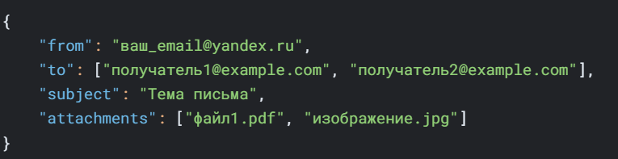

# SMTP клиент

## Задание

В отдельной папке лежит конфигурационный файл, текстовый файл с письмом и файлы-аттачменты (картинки, документы и т. д.). В текстовом фале пользователь пишет письмо (plain text) на английском или русском языке. В конфигурационном файле пользователь задает адрес получателя(лей), тему (возможно на русской языке) и имена файлов-аттачментов для отсылки в виде вложения.

## Запуск программы:

`python sntp.py`

# Подготовка файлов

1. config.json - конфигурационный файл в формате JSON:

2. msg.txt - текст письма:

3. pswd.txt - пароль от почтового ящика (или пароль приложения):

# Настройка почтового аккаунта
Для Яндекса необходимо разрешить доступ для небезопасных приложений:

- Войдите в Яндекс.Почта

- Настройки → Все настройки → Пароли и авторизация

- Включите "Разрешить доступ по паролю для почтовых программ"

Если включена двухфакторная аутентификация:

- Создайте "Пароль для приложений" в настройках безопасности

- Используйте его вместо основного пароля

После запуска вы увидите в консоли диалог с SMTP-сервером:

Для отправки через Gmail нужно разрешить "ненадежные приложения" в настройках аккаунта Google.