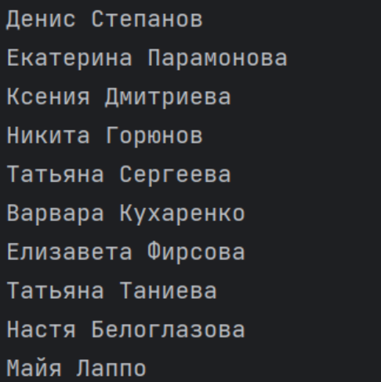

## Использование VK API

Войнова Анна КН-202

## Задача

API. Требуется, используя, API В Контакте получить информацию и вывести ее в удобочитаемом виде.
Вывести список друзей указанного пользователя

## Запуск программы

`python main.py`
 
## Далее нужно будет ввести дынные(access token и ID пользователя)

Enter VK API access token:

Enter VK user ID:

## Результат работы:

